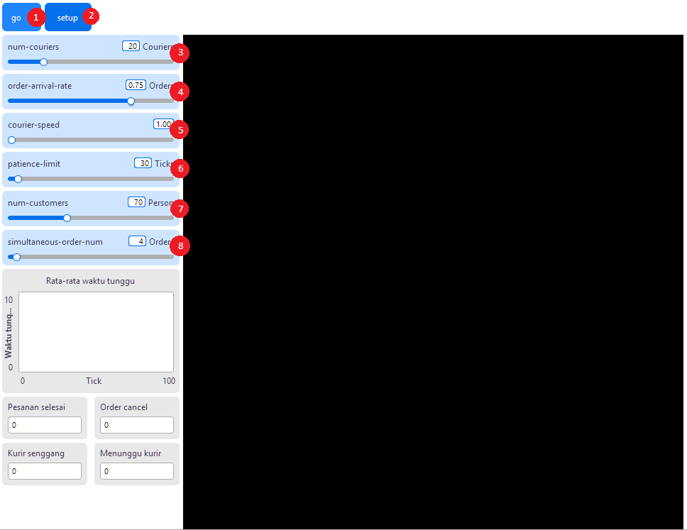
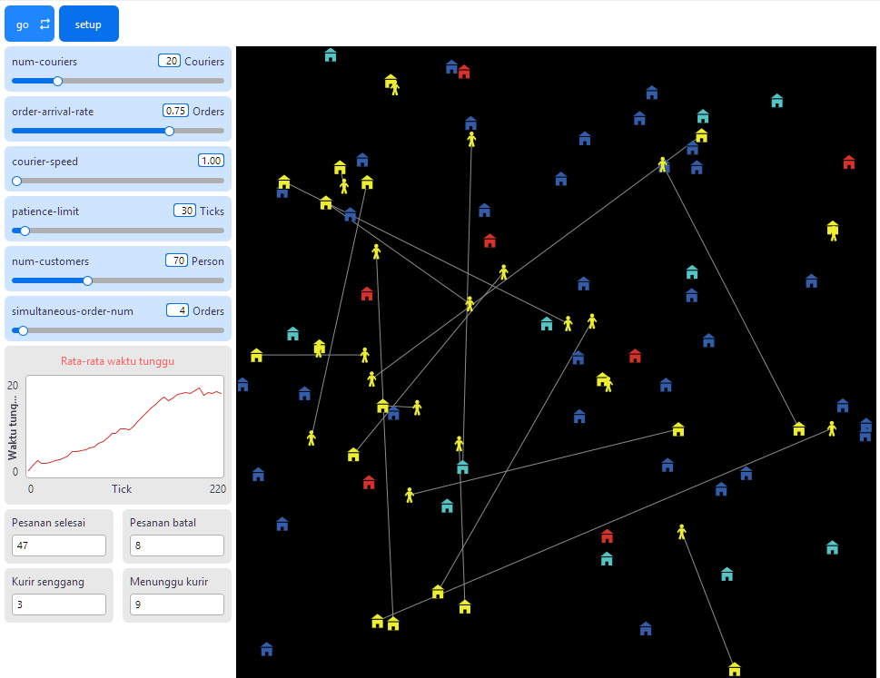

## WHAT IS IT?

Model to simulate the dynamics of online orders and couriers

## HOW IT WORKS

The simulation consists of two agents, namely customer agent and courier agent of which represented by turtles in the shape a house and a person. A number of customer agent (based on `simultaneous-order-num`) will be selected randomly on every tick to place an order and wait until their order is picked up by a courier. If the customer has waited for too long (more than `patience-limit`), the customer will cancel their order. However, if a courier picks up the order, the customer will wait until the courier delivers the order to their location. But if the courier takes too long (more than `patience-limit`), the order will also be cancelled.

## HOW TO USE IT

Model is started by pressing the `setup` (1) button to generate courier agents and customer agents, and then press the `go` (2) button to simulate their behavour.

3. `num-couriers`: how many courier agents will be generated
4. `order-arrival-rate`: the probability customer agents will place an order in every ticks
5. `courier-speed`: the speed courier agents should move
6. `patience-limit`: how many ticks customer agents will wait until they cancel their order
7. `num-customers`: how many customer agents will be generated
8. `simultaneous-order-num`: how many customer agents can place an order in every ticks

## THINGS TO NOTICE

(suggested things for the user to notice while running the model)

Customer and courier agents behaviour is shown in the world. Each customer and courier agents state is colour coded.

Customer agent:
- `cyan`: placed an order and waiting for a courier to pick it up
- `yellow`: waiting for their order to be delivered by the courier
- `turquoise`: order has been delivered
- `red`: order has been cancelled for waiting too long
- `white`: agent is ready to place an order (default state)

Courier agent:
- `green`: agent is not taking an order and roaming about
- `yellow`: agent is delivering an order and currently moving to a customer's position

Another things to notice are:

1. rata-rata waktu tunggu plot: shows the average waiting time of every customer agents for every ticks
2. Pesanan selesai monitor: shows how many orders have been delivered since `go` button is pressed
3. pesanan batal monitor: shows how many orders have been cancelled since `go` button is pressed
4. kurir senggang monitor: shows how many courier agents currently not delivering an order
5. menuggu kurir monitor: shows how many customer agents currently waiting for a courier agent to take their order

## THINGS TO TRY

Move each sliders to try simulate rush hour or many different real life conditions

## EXTENDING THE MODEL

Further developments could try to create a road map that courier agents must follow to reach their customers. Craeting other agents to represent the sellers from whom customers place orders could also better simulate real-world conditions where courier must go from point A to Seller B before trying to reach the customer.